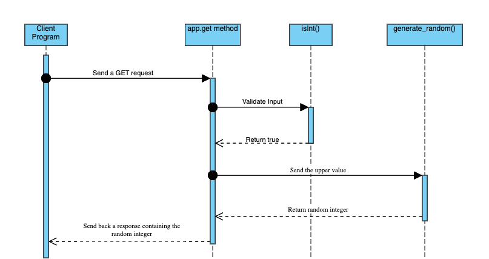

# Random Number Generation Microservice

- [How to Request Data?](#how-to-request-data)
  - [Request Parameters](#request-parameters)
- [How to Receive Data?](#how-to-receive-data)
- [Example #1](#example-1-200-ok)
- [Example #2](#example-2-400-bad-request)
- [Example #3](#example-3-200-ok)
- [UML Sequence Diagram](#uml-sequence-diagram)
  
## How to _Request_ Data?
1. Send an HTTP request using the POST method to the [localhost:3000/randnum](http://localhost:3000/randnum) endpoint.
2. Set the `upper` data parameter value. This will be used to generate random integers from `1` to `upper`.
3. Receive the random number.

### Request Parameters
Although the `upper` parameter is the only **required** part of the request, there are other optional parameters that could be useful.
- `upper` - the largest generated value. 
- `lower` (optional) - this is `1` by default and it represents the lowest generated value.
- `min_limit` (optional) - the minimum accepted value. `1` by default.
- `max_limit` (optional) - the maximum accepted value. `1000` by default.

## How to _Receive_ Data?
The generated random number will be sent with a `200 OK` response as the value of the `number` key in a JSON object. See the example below.

## Example #1 (200 OK)
> [!NOTE]
> Examples of requests are formatted for readability. The original URL is provided.

Formatted request:
```javascript
{
  upper: '6'
}
```

Response:
```JSON
{
    "number": 4
}
```


## Example #2 (400 Bad Request)
Formatted request: 
```javascript
{
  lower: '0',
  upper: '6'
}
```
Response:
```JSON
{
    "error": "Out of range - the 'lower' and|or 'upper' values must be in the closed range [1 - 1000]."
}
```
> [!IMPORTANT]
> If you wish to use `0` as a value of `lower`, then you must modify the `min_limit` to be less than or equal to your desired `lower` limit.


## Example #3 (200 OK)
Formatted request:
```javascript
{
   "lower":"10",
   "upper":"16",
   "min limit":"10",
   "max limit":"20"
}
```
Response:
```JSON
{
    "number": 12
}
```

## UML Sequence Diagram

